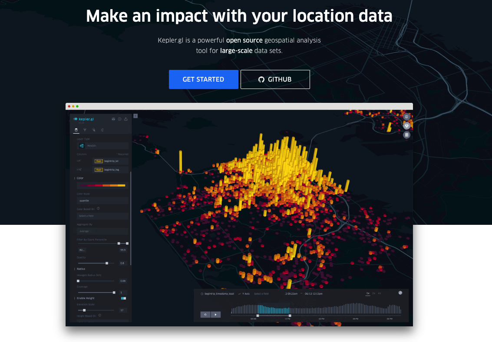
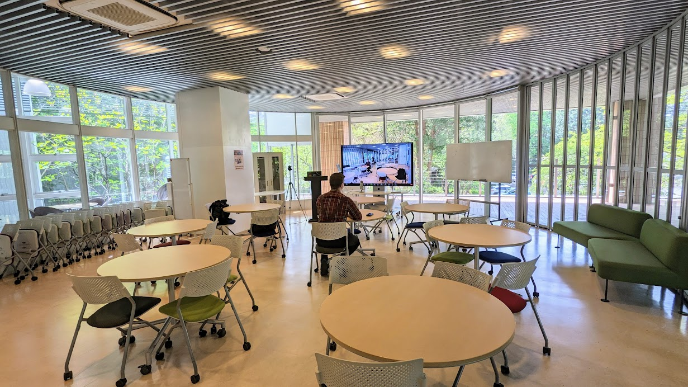

## Week 1 | April 15, 2023

<xl>
Introduction to GIS 
</xl>

 
GISの世界へようこそ

# 

<xls>
  Let's
   
  make
   
  maps
   
  that
   
  matter

</xls>

 
 
 
 
 
 
 
 
 

# Join the class!

#### Step 1

### Step 2

# Hello!

## Call me "Yoh"

## 

[My journey](https://yohman.github.io/21S-DH151/Weeks/Week01/misc/me.html)

##

##

##

## My teaching philosophy 私の教育哲学

##
<xl>
Learn by doing, sharing, and talking

</xl>

### 1: class = community

### 2: it's a two way street

Source: LA Times

### 3: sharing is caring

[Source: CDTA Law](https://cdtalaw.com/cdta/the-importance-of-sharing-knowledge-in-any-legal-context/)

# Schedule スケジュール

## 

Week | Topic 
--|--
Week 1 | オリエンテーション What is GIS? 
Week 2 | Humanitarian Mapathon
Week 3 | GIS, Python, Jupyter Notebooks

###

Week | Topic
--|--
Week 4 | Mapping points Japan rail data (or earthquakes)
Week 5 | Mapping open data Open street maps
Week 6 | グループワーク① Group work ①
Week 7 | グループワーク② Group work ②

###

Week | Topic
--|--
Week 8 | 中間プレゼンテーション Midterm Presentations

###
Week | Topic
--|--
Week 9 | Mapping Census Data ①
Week 10 | Mapping Census Data ②
Week 11 | Point pattern analysis 

###
Week | Topic
--|--
Week 12 | Spatial autocorrelation
Week 13 | グループワーク② Group work ①
Week 14 | グループワーク② Group work ②

###
Week | Topic
--|--
Week 15 | ファイナルプレゼンテーション Final Presentation 

## Grading｜成績評価

- 出席（１５回） 50%
- 宿題 （5回）10% 
  - 回数は変わるかも
- プレゼン（２回） 40%

## 
出席 (1500 x 1/15 x 0.5)
 +
宿題 (500 x 1/5 x 0.1)
 +
プレゼン (200 x 1/2 x 0.4) 
 \=
 100

##
- 出席率60%以上で評価対象となります
(大学全体と同様)
- 宿題は期限までに出せば１００点

# Your turn! | あなたの番

- your name | 名前
- your passion | 最近ハマってるもの
- your research interest | 研究するとすればこんなことやってみたい
- what might you map? | どんな地図を作ってみたい？

### 
<xl>
「地図」と言われ、思い浮かぶものって何？
</xl>

 

思い浮かぶものを[Jam Board](https://jamboard.google.com/d/16CLh2yYLeCkwERYYO3WkTgiYwGEZq2B1ZXXjps1EX7U/edit?usp=sharing)に書いてね

# 
<xl>

Let's make some maps! 
地図を作ろう

</xl>

#

Join mapbox

1. go to https://www.mapbox.jp/ 
1. create an account
# 

Create your own "basemap"

<small>

1. go to https://apps.mapbox.com/cartogram/
1. select a photo/image of interest (ドラえもんとか) and create a custom map!

</small>

# 

Save your map and go to Mapbox Studio

# 

This is Mapbox Studio. Go crazy!

#

Add your map to the [class map gallery](https://docs.google.com/presentation/d/16BgQL827XtDQlVaJhYhiZAwJ4v_DoOtnhvbc2yVwK0M/edit?usp=sharing)
1. create a new slide
1. add your name
1. add the photo/image used for your map
1. add a screenshot of your map
1. add a link to your map (share button on Mapbox Studio)

#
<xl>
来週は 
マッパソン！
</xl>

 
クラスの集合場所は: 

iFloor Presentation Room
%20(1).png)

[more details](https://docs.google.com/presentation/d/1_42p2ixynqlfds9DDWPYI81yoeFLwHris1-jBLmb5ng/edit?usp=sharing)

# 

If time permits...

<xl>

地図を作ろう
パート２

</xl>

#

Find your Latitude/Longitude coordinates

1. go to https://www.google.com/maps
1. zoom to your hometown (生まれた場所)
1. right click!
1. copy the coordinates
1. enter it in [this google sheet](https://docs.google.com/spreadsheets/d/1tyBPpO-3ltcyQUo5JNxshqv-bArlDI3Du2pThHelqYw/edit?usp=sharing)

# 

Use kepler to map all your classmates

1. download the google sheet as a csv file
1. go to http://kepler.gl
1. map your classmates!

 
あえてやり方を教えません 
隣の人と相談しながらカッコイイ地図を作ってね！

#

See you on the iFloor next week!
