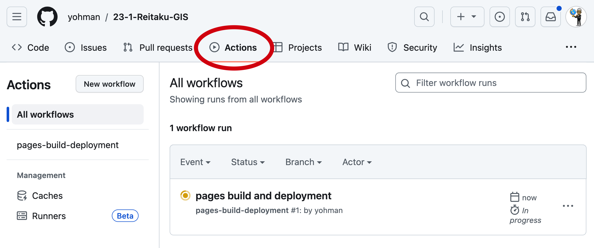

## Week 5

<xl>
Introduction to GIS 
</xl>

 
GISの世界へようこそ

#

Publishing your Web Map

## Set up "Pages" on GitHub

1. Go to your GitHub GIS repository
1. Click on "Settings"

## 

1. Click on `pages`
1. Under `Branch` click on the `None` dropdown
1. Select `main`
1. Click on `save`

##

1. Go to `Actions`
1. Confirm that 